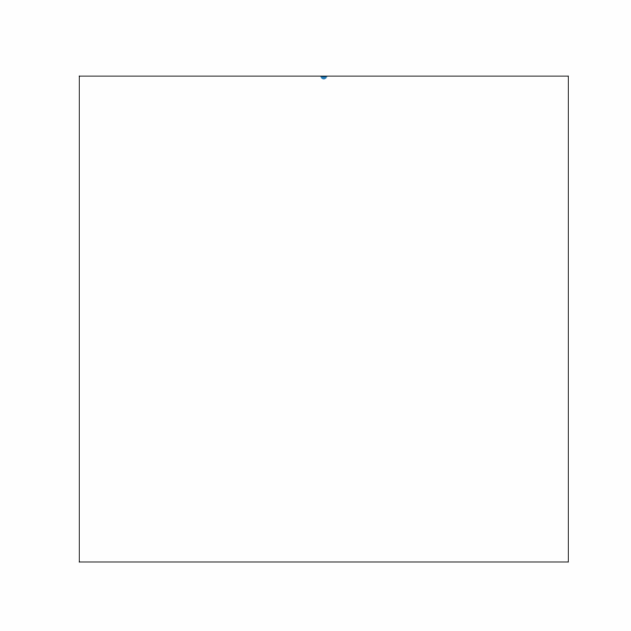

# Sierpinski Fractals
The noetbook provided generates Sierpinski fractals from various polygons based on [n-flakes](https://en.wikipedia.org/wiki/N-flake)

The algorithm, at it's simplest form is

## Step 1


## Step 2


## Step 3


## Step 4


## Step 5


## Step 6 is repeated


## This will yeild


The `fractile(sides=3, size=3, frac=(2/3), points=100000)` function arguments can be manipulated to create variations of the fractas produced

```
sides (int) - Number of sides for the polygon
size (int) - Length of polygon sides
frac (float) - Ditance to the draw the generated point
points (int) - Number of points to draw
```

```fractile_gif()``` funtion will animate points 1 by 1 for a more precise, however slower, animated plot

```fractile_sns_gif()``` funtion will animate points by iterations of 50, for a faster animated plot


