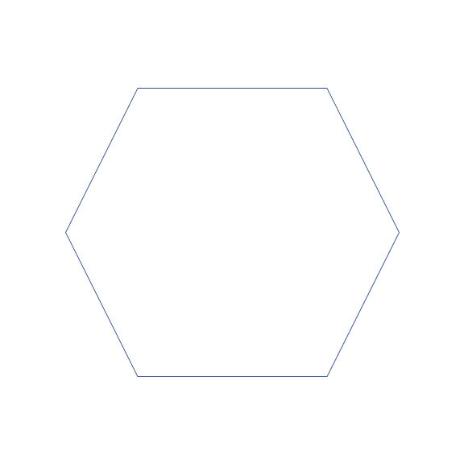
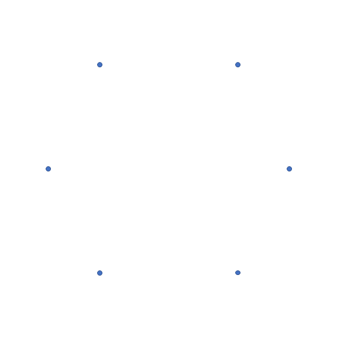
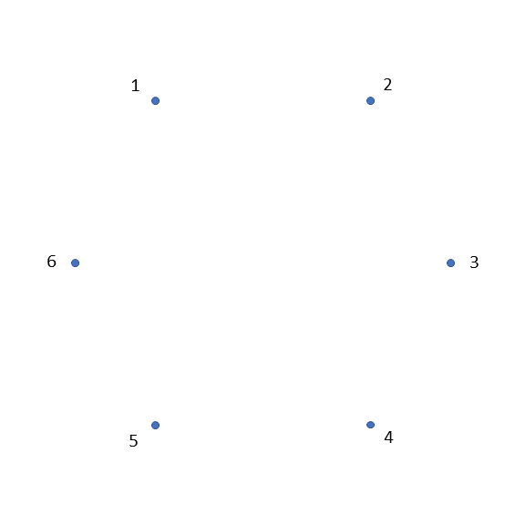
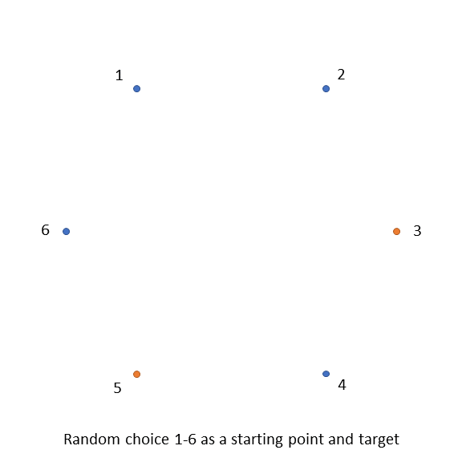
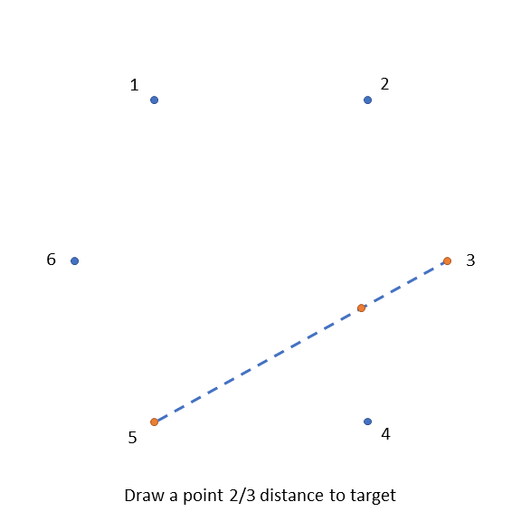
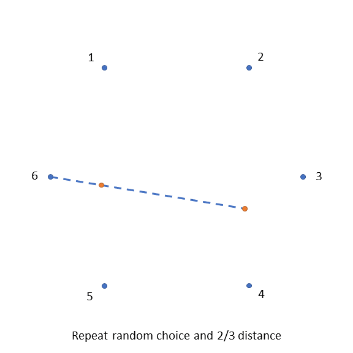

# Sierpinski Fractals
The noetbook provided generates Sierpinski fractals from various polygons based on [n-flakes](https://en.wikipedia.org/wiki/N-flake)

The algorithm, at it's simplest form is

